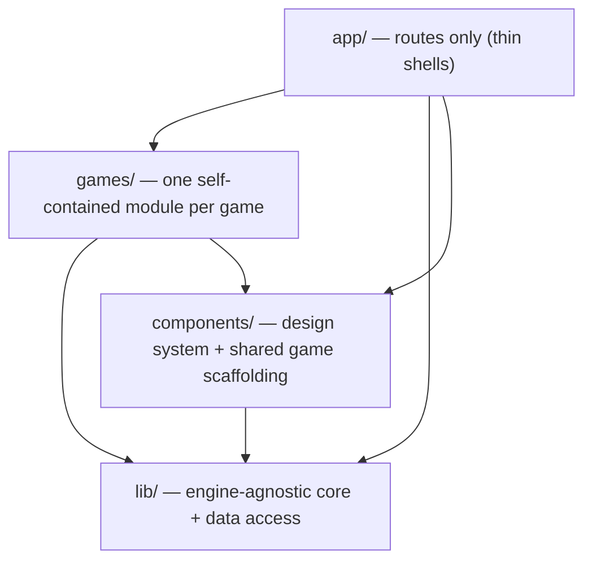

# Refactor Plan — English Game Hub

Status: **all phases complete.** This document is now both the record of the refactor and the
guide for adding new games.

## Guiding principle

Three layers, strictly one-directional:



- A game module never imports another game module.
- `lib/` and `components/` never import from `games/` or `app/`.
- Adding a game = adding one folder + one registry entry, touching zero existing game code.

---

## Folder structure

```
app/
  layout.tsx
  page.tsx                          # hub — renders from the game registry
  games/
    falling-sentences/{page,play/page,result/page}.tsx   # one-line shells
    word-scramble/{page,play/page,result/page}.tsx
    fill-the-blank/{page,play/page,result/page}.tsx
  api/{categories,sentences,translate}/route.ts

games/
  types.ts                          # GameDefinition, SkillTag, gameRoutes()
  registry.ts                       # GAMES[] — single source of truth
  falling-sentences/
    definition.ts                   # metadata + routes
    config.ts                       # difficulty/speed presets, lanes, HUD timing
    types.ts                        # FallingSentence, GameState, GameConfig, …
    session.ts                      # createGameSession('falling-sentences')
    engine.ts                       # spawn, physics, targeting, keystrokes, telemetry
    components/{setup-screen,arena,result-screen}.tsx
    index.ts                        # public barrel
  word-scramble/
    definition.ts / config.ts / types.ts / session.ts
    components/{setup-screen,play-screen,result-screen}.tsx
    index.ts
  fill-the-blank/
    definition.ts / config.ts / types.ts / session.ts
    engine.ts                       # blank selection + distractor generation
    components/{setup-screen,play-screen,result-screen}.tsx
    index.ts

lib/
  theme.ts                          # accent tokens mirroring globals.css
  core/                             # engine-agnostic, no game or data imports
    types.ts                        # Difficulty, LibraryCategory, SentenceRecord
    constants.ts                    # word-count bands, combo cap, WPM window
    text.ts                         # cleanWord, parseCustomText, shuffle, …
    scoring.ts                      # WPM, accuracy, combo, peak tracking
    audio.ts                        # WebAudio synth sound effects
    session.ts                      # createGameSession — typed sessionStorage handoff
  data/
    db.ts                           # Neon connection factory
    fallback.ts                     # offline categories + sentence libraries
    sentence-pool.ts                # library filtering by difficulty band
  hooks/
    use-categories.ts               # /api/categories + fallback + status
    use-sentence-library.ts         # /api/sentences
    use-translations.ts             # lazy + batch translation cache

components/
  ui/                               # glass-card, neon-button, section-title,
                                    # stat-tile, search-input
  game/                             # category-picker, stats-grid,
                                    # sentence-review-list, game-card

scripts/
  db/                               # seeding, export, import, translation jobs
  seeds/                            # per-category content
```

---

## The two contracts that make it extensible

### 1. `games/types.ts` — game metadata

```ts
export interface GameDefinition {
  id: string;
  slug: string; // URL segment under /games
  title: string;
  tagline: string;
  description: string;
  icon: string;
  accent: AccentToken; // from lib/theme.ts
  skills: SkillTag[]; // typing | vocabulary | grammar | reading | listening
  status: "live" | "beta" | "coming-soon";
  estimatedMinutes: number;
}

export function gameRoutes(slug: string): {
  setup: string;
  play: string;
  result: string;
};
```

`games/registry.ts` exports `GAMES` and `getGame(slug)`. The hub maps over it, so a new game
appears automatically — including `coming-soon` placeholders, which render disabled.

### 2. `lib/core/session.ts` — typed handoff

```ts
export function createGameSession<TConfig, TResult>(gameId: string) {
  return { saveConfig, loadConfig, saveResult, loadResult, clear };
}
```

Keys are namespaced `<gameId>:config` / `<gameId>:result`, so games never collide. Each game
owns exactly one `session` object exported from `games/<slug>/session.ts`.

---

## Phases (all done)

### Phase 0 — Foundations

`lib/theme.ts` with accent tokens mirroring `app/globals.css`. No `tsconfig.json` change was
needed: the existing `"@/*": ["./*"]` alias already resolves `@/games/*`, `@/lib/*`, and
`@/components/*`.

### Phase 1 — UI kit

`components/ui/` primitives plus `components/game/` scaffolding. Both setup screens and both
result screens were swapped onto them.

`CategoryPicker` standardises on the richer Falling Sentences styling, so the Word Scramble
setup screen changed appearance. This also fixed a latent bug there: it mapped `c.name` from
`/api/categories`, which returns `label` — every DB-loaded category rendered with an empty
title.

### Phase 2 — Shared hooks + session

`createGameSession`, `useCategories`, `useSentenceLibrary`, `useTranslations`. No raw
`sessionStorage` access or `fetch('/api/translate')` calls remain outside `lib/`.

Hooks live in `lib/hooks/` rather than `components/hooks/` — they aren't components.

### Phase 3 — Core lib reorg

Moved audio/scoring/text into `lib/core/`, DB access and offline content into `lib/data/`.

Two deviations from the original sketch, both to avoid splitting cohesive code for its own sake:

- `lib/core/audio.ts` stayed one file instead of `audio/engine.ts` + `audio/sfx.ts`.
- Sentence helpers split by **dependency direction** rather than by name: pure helpers in
  `lib/core/text.ts`, library lookups that need fallback content in `lib/data/sentence-pool.ts`.
  This is what keeps `lib/core/` free of data-layer imports.

`DIFFICULTY_WORD_RANGES` was extracted to `lib/core/constants.ts` because sentence length is a
content concept shared by all three games; the falling-sentences `DIFFICULTY_CONFIGS` now
references it.

### Phase 4 — Falling Sentences module

Engine and screens moved into `games/falling-sentences/`. `tokenizeSentence` moved from the
shared pool into the engine, since the `raw`/`clean`/`charIndex` token shape only makes sense
for a typing game.

The engine stayed a single `engine.ts` rather than a five-file `engine/` directory — the spawn,
physics, and keystroke functions all mutate the same `GameState` and read better together.

### Phase 5 — Word Scramble module

Screens moved into `games/word-scramble/`; `WordToken`/`DragPayload` moved from inline
declarations into `types.ts`; round options, fetch limit, and fallback sentences moved into
`config.ts`.

### Phase 6 — Registry + hub

`games/registry.ts` plus a `GameCard` component; `app/page.tsx` rewritten to render from the
registry; `next.config.ts` redirects `/words*` and `/scramble*` to the new `/games/*` paths;
`app/layout.tsx` metadata retitled to the hub rather than a single game.

### Phase 7 — Extensibility validation

Built **Fill the Blank** end to end: one word is removed from each sentence and the player picks
it from four options. It required **zero changes to the other two game modules** — only a new
`games/fill-the-blank/` folder, three route shells, and one registry entry. It reuses
`CategoryPicker`, `StatsGrid`, `SentenceReviewList`, `GlassCard`, `NeonButton`, `useCategories`,
`useTranslations`, `createGameSession`, `shuffle`, `cleanWord`, and the audio engine.

---

## Adding a game

1. Create `games/<slug>/`:
   - `definition.ts` — `GameDefinition` + `export const routes = gameRoutes(definition.slug)`
   - `types.ts` — config, per-round state, completion payload
   - `config.ts` — tunables and presets
   - `session.ts` — `createGameSession<Config, Result>('<slug>')`
   - `engine.ts` — pure game logic (optional, if there is any)
   - `components/{setup,play,result}-screen.tsx`
   - `index.ts` — barrel exporting `definition`, `routes`, `session`, and the three screens
2. Add three shells under `app/games/<slug>/`:
   ```ts
   export { SetupScreen as default } from "@/games/<slug>";
   ```
3. Append the definition to `GAMES` in `games/registry.ts`.

Set `status: 'coming-soon'` to list a game on the hub before it is playable.
